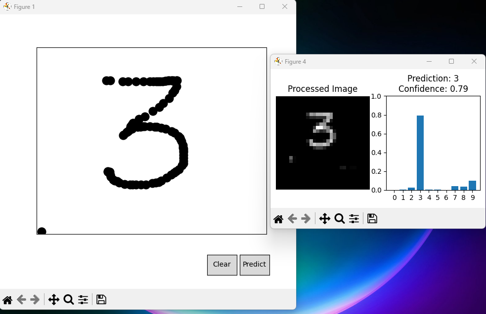
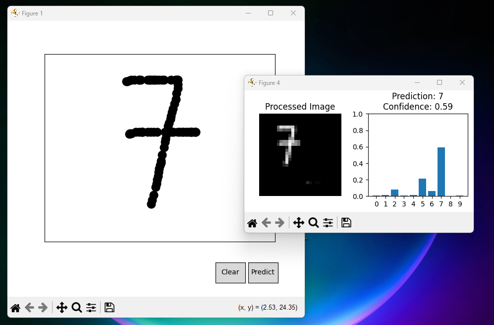
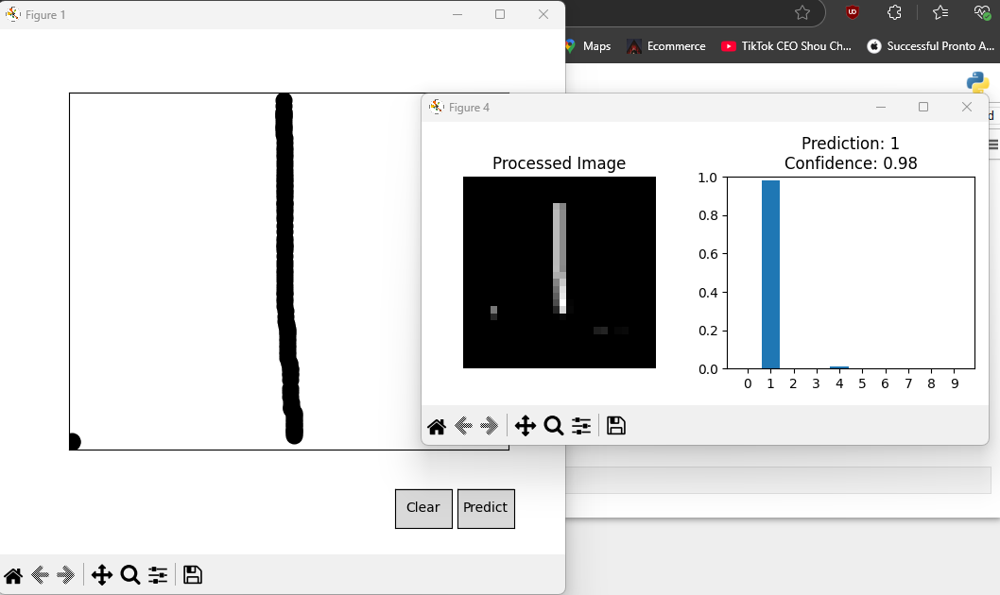

# 🖍️ Handwritten Digit Recognition using Neural Network

This project is a handwritten digit recognizer built using TensorFlow and Keras. It uses a neural network trained on the MNIST dataset to classify digits from 0 to 9.

### 🧠 Model Summary
- **Input Shape:** 28x28 grayscale images
- **Architecture:** 
  - Flatten layer
  - Dense (128, ReLU)
  - Dense (64, ReLU)
  - Dense (10, Softmax)
- **Optimizer:** Adam  
- **Loss Function:** Categorical Crossentropy  
- **Accuracy Achieved:** ~97%

### ✍️ Features
- Train a digit recognition model
- Test on preloaded test set
- Draw digits in a canvas and get real-time predictions

### 📷 Demo
Here’s a sample prediction:

### 📂 Files
- `train_model.py` - Train the model
- `model.h5` - Saved trained model
- `digit_draw_predictor.py` - GUI to draw digits and predict
- `test.csv` - Test data for evaluation

---

**Note**: This is a beginner-friendly project perfect for learning about image classification and neural networks.
